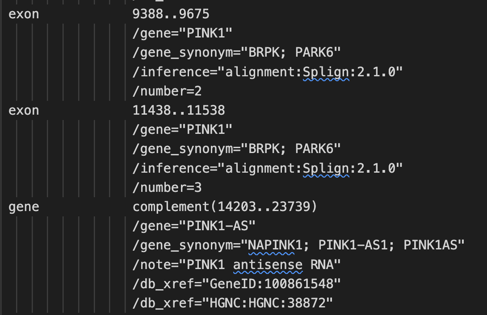

# GetCodingSequences: a coding/non-coding sequence extractor to be used with Genbank files.

### Oliver Bonham-Carter, [Allegheny College](https://allegheny.edu/)
### email: obonhamcarter@allegheny.edu

---

Figure 1. A GCS stands for _Get Coding Sequences_.
Genetic Music: Use your ears to study DNA!!

## Table of Contents

- [Description](#description)
- [Running the code](#running-the-code)
- [Mechanism](#mechanism)
- [Future Work](#future-work)

## Description

Often, when you have a tool from Bioinformatics, sequences are the input. This program, **GCS** creates fasta files of the coding sequences (producing protein) of a GenBank file. In addition, the program also outputs the non-coding sequences (those that produce no-known protein) from the Genbank file. These sequences can then be used for research or to test new tools. 


Figure 2. In a GenBank file, there are references for the coding regions. 

## Mechanism

GCS works by locating the coding sequences from a GenBank file by finding their location references in the record, as shown in Figure 2. Then GCS locates the actual sequences using these starting and ending markers, and places this sequence data into fasta files. The noncoding regions are located by removing the coding regions from main sequence. The remaining sequence, from which all coding information has been removed, is the non-coding region. Sequences are then extracted from this body of non-coding genetic material. 

```
    numOfSeqs_int = 20
    maxSize_int = 400
```
Note: shown above, the size of the extracted sequences is 400 base-pairs but this value may be customized in main.py, along with the number of sequences to produce. 

## Running the code

You must first install [Poetry](https://python-poetry.org/) to manage the sode's dependencies, and to run the program.

```
* Setup with Poetry : 
    + poetry install
* Find online help:
    + poetry run gcs --bighelp
* Produce reduced-sized sequences from a genbank file:
    + poetry run gcs --data-file data/df.gb
* Produce full-sized sequences from a genbank file:
    + poetry run gcs --data-file data/df.gb --fullseqs
```

**OUTPUT**: All output files are saved in the directory `0_out/

## Future Work

This is a program to used primarily to obtain DNA sequence data.
One of the main reasons to create genetic data as sequence files is 
to facilitate and provide data for another excellent project:
[Genmus](https://github.com/developmentAC/geneticMusic),
which converts DNA `fasta` sequences into piano music.

This is also a work in progress. If you see anyway to improve it, 
please let me know, or actually make that improvement in the code
via a pull request. I would be very grateful for any productive input
that you may have. 
